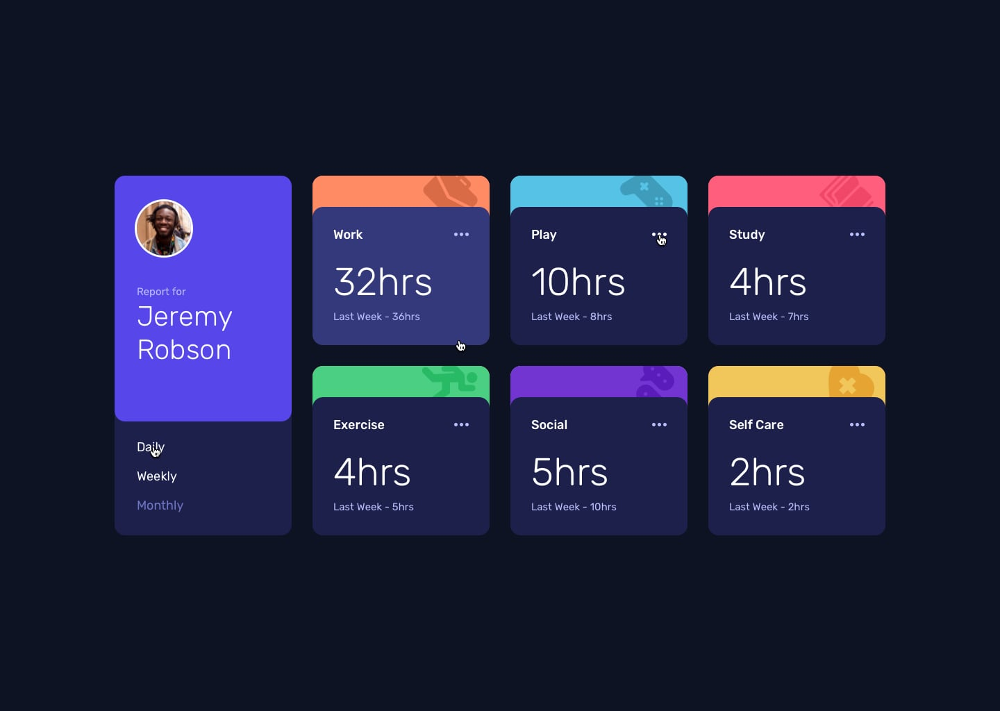

# Time Tracking Dashboard

## Track your time efficiently and improve your productivity with the Time Tracking Dashboard. Switch between daily, weekly, and monthly stats effortlessly.

## Table of contents

- [Overview](#overview)
  - [The challenge](#the-challenge)
  - [Screenshot](#screenshot)
  - [Links](#links)
- [My process](#my-process)
  - [Built with](#built-with)
  - [What I learned](#what-i-learned)
  - [Continued development](#continued-development)
  - [Useful resources](#useful-resources)
- [Author](#author)
- [Acknowledgments](#acknowledgments)

## Overview

### The challenge

Track your time efficiently and improve your productivity with the Time Tracking Dashboard. Switch between daily, weekly, and monthly stats effortlessly.

Users should be able to:

- View the optimal layout for the component depending on their device's screen size
- See the social media share links when they click the share icon

### Screenshot



### Links

- Solution URL: [GitHub Repository](https://github.com/singshubhs/Digital_welbeing_Project)
- Live Site URL: [Live Site](http://127.0.0.1:5500/Digital_Welbeing/index.html)

## My process

### Built with

- HTML5
- CSS3
- JavaScript

You will find all the required assets in the `/design` folder. The assets are already optimized.

There is also a `style-guide.md` file containing the information you'll need, such as color palette and fonts.

### What I learned

- Implementing interactive features such as toggling between daily, weekly, and monthly stats
- Designing a user-friendly interface with hover states for interactive elements
- Enhancing accessibility and usability for seamless navigation and interaction

```js
// Fetch and parse the JSON data
fetch("data.json")
  .then((response) => response.json())
  .then((data) => {
    // Loop through the cards and update the data
    cards.forEach((card, index) => {
      const title = card.querySelector(".card-type");
      const current = card.querySelector(".current-hours");
      const previous = card.querySelector(".previous-hours");

      // Initial data display
      title.textContent = data[index].title;
      current.textContent = data[index].timeframes.weekly.current + "hrs";
      previous.textContent =
        "Last week - " + data[index].timeframes.weekly.previous + "hrs";

      // Link event listeners
      links.forEach((link) => {
        link.addEventListener("click", (e) => {
          e.preventDefault(); // Prevent the default link behavior

          const timeframe = link.getAttribute("data-timeframe");
          current.textContent =
            data[index].timeframes[timeframe].current + "hrs";
          const reducedName = timeframe.replace(/ly$/i, "");
          const goodName = reducedName.replace(/i/i, "y");

          previous.textContent =
            "Last " +
            goodName +
            " - " +
            data[index].timeframes[timeframe].previous +
            "hrs";
          links.forEach((link) => link.classList.remove("activated"));
          link.classList.add("activated");
        });
      });
    });
  })
  .catch((error) => console.error(error));
```

### Continued development

- Adding additional features such as customizable time tracking categories and goal setting functionality
- Improving performance and optimization for smoother user experience
- Enhancing responsive design for consistent experience across devices

The continuously learning journey of a programmer never ends. This project made me realize that there are many concepts that I need to work upon including fundamentals like flex-box and its properties, to more complex concepts like working with fetch and async await in javascript. These areas are some that I think I need to work more upon in the upcoming future as they highlight some of the most significant regions of web development that are important for every developer to know of. 

These key points mentioned here will help me grow accountable and consistent towards improving at writing good quality code and be a successful full stack developer one day.

### Useful resources

- [MDN Web Docs](https://developer.mozilla.org/) - Comprehensive documentation for web development technologies
- [CSS-Tricks](https://css-tricks.com/) - Helpful tips and tricks for CSS and web design
- [JavaScript.info](https://javascript.info/) - In-depth tutorials and resources for learning JavaScript
- [Harkirat Singh course notes](https://github.com/SartHak-0-Sach/harkirat-singh-course_code_and_notes) - I have added notes of all lectures along with code and lecture insights of all weeks along with bonus lectures to help you all as much as I can.

- [MDN documentation hover state for CSS](https://developer.mozilla.org/en-US/docs/Web/CSS/:hover) - This is an amazing article which helped me finally understand hover states. I'd recommend it to anyone still learning this concept.

## Author


## Acknowledgments

I feel like the solutions provided on the website and the continuous doubt solving by industry experts on discord for free is something that is unmatched by anyone else and need to be acknowledged for their efforts in improving me as a developer by suggesting the best practices in your respective tech stack.

## Got feedback for me?

I love receiving feedback! I am always looking to improve my code and take up new innovative ideas to work upon. So if you have anything you'd like to mention, please email 

If you liked this project make sure to spread the word and share it with all your friends.

**Track your time efficiently and improve your productivity with the Time Tracking Dashboard.** ⏰🚀✨
